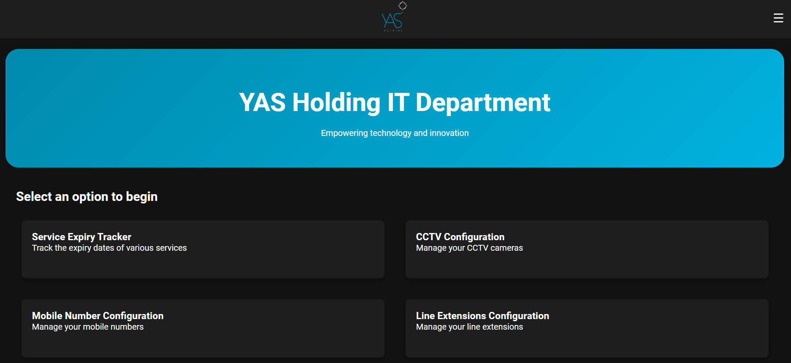
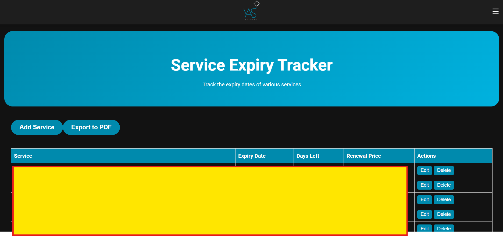
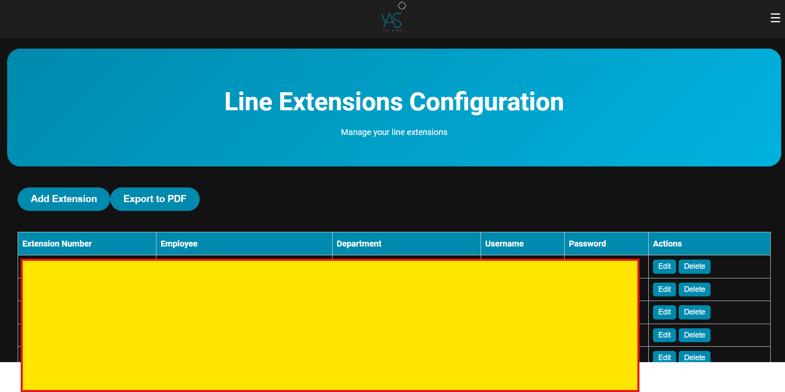
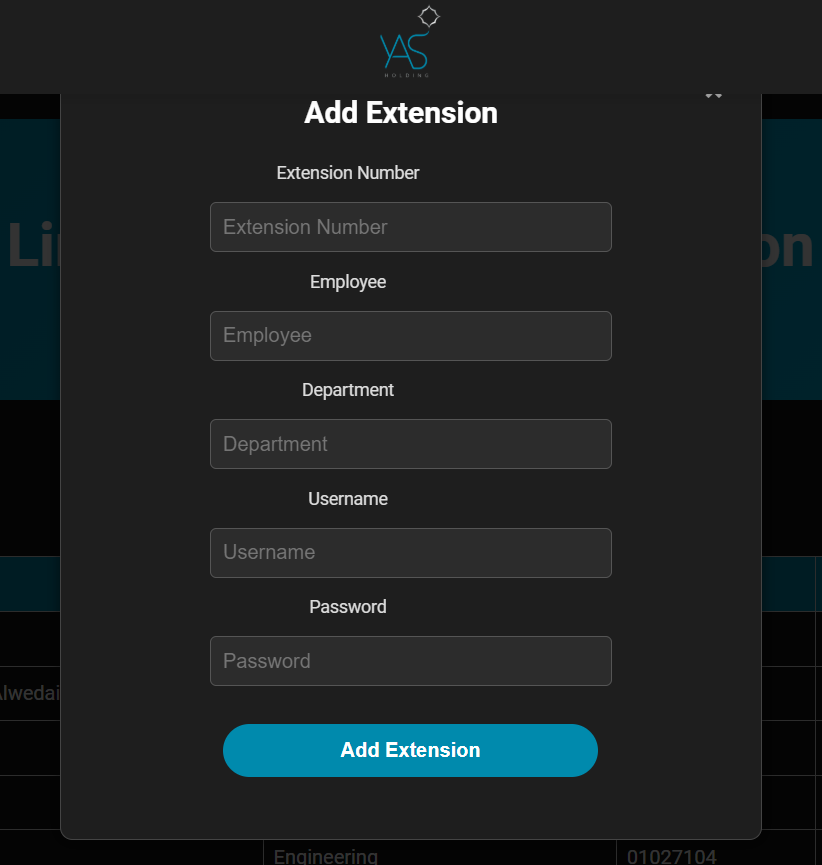
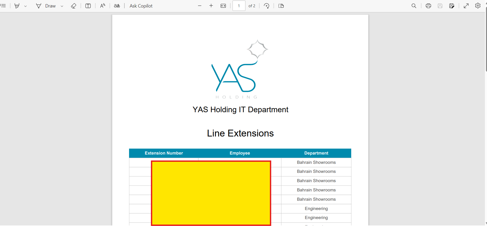
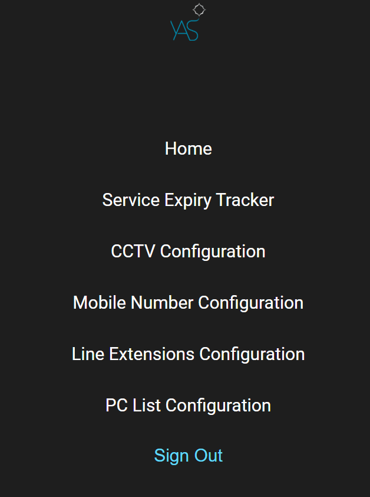
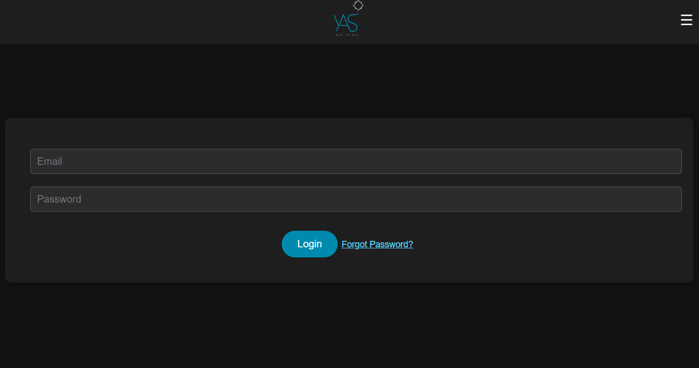

# IT Desk Management App

This project is the IT Desk Management app developed using React and Firebase as the backend. The application is designed to streamline IT operations, allowing the IT desk to efficiently track and manage various configurations and services.

## Features

- **Service Expiry Tracker**: View, add, update, delete, and export service expiry information to PDF.
- **CCTV Configuration**: Add, update, and delete CCTV configuration details.
- **Mobile Number Configuration**: Add, update, and delete mobile number configuration details.
- **Line Extensions Configuration**: Add, update, delete, and export line extensions configuration to PDF.
- **PC List Configuration**: Add, update, and delete PC list configuration details.
- **Authentication**: Secure access to the IT desk with authentication.

## Technologies Used

- React
- Firebase
- CSS

## Functionalities

### Service Expiry Tracker

- **View**: Display a list of services with their expiry dates.
- **Add**: Insert new service expiry details.
- **Update**: Modify existing service expiry information.
- **Delete**: Remove service expiry records.
- **Export to PDF**: Generate a PDF report of service expiry details.

### CCTV Configuration

- **Add**: Insert new CCTV configuration details.
- **Update**: Modify existing CCTV configuration information.
- **Delete**: Remove CCTV configuration records.

### Mobile Number Configuration

- **Add**: Insert new mobile number configuration details.
- **Update**: Modify existing mobile number configuration information.
- **Delete**: Remove mobile number configuration records.

### Line Extensions Configuration

- **Add**: Insert new line extensions configuration details.
- **Update**: Modify existing line extensions configuration information.
- **Delete**: Remove line extensions configuration records.
- **Export to PDF**: Generate a PDF report of line extensions configuration.

### PC List Configuration

- **Add**: Insert new PC list configuration details.
- **Update**: Modify existing PC list configuration information.
- **Delete**: Remove PC list configuration records.

### Authentication

- **Secure Access**: Authentication to restrict access to authorized personnel only.

## License

This project is licensed under the MIT License.

## Screenshots

